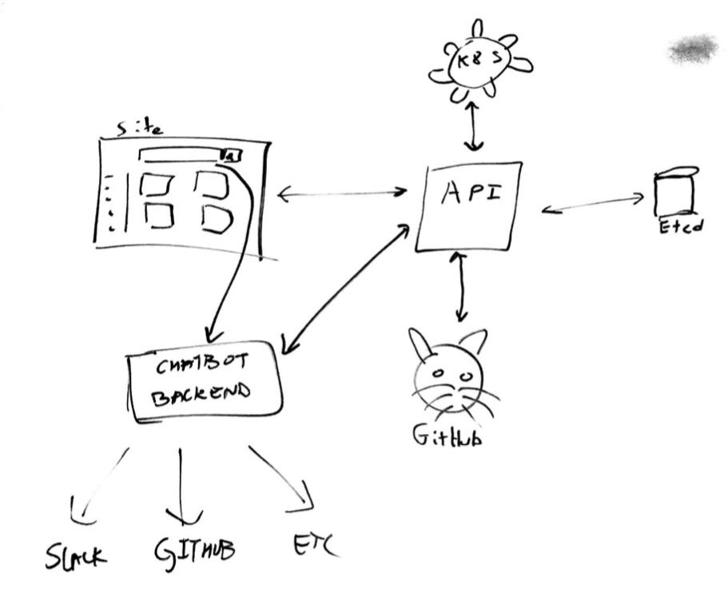

Time: 15:15-17:00

# Todo
- Learn about KNative
- Create functional requirements
- Create example serverless apps
- Learn about Openshift
- Learn go

# Timeline
Phase 1:

- App API
- Site
- Examples

Phase 2:

- Deploy
- Chat-bot

# High Level Design

